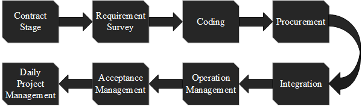

# Software Project Management

*Whenever you commit to this repository, GitHub Pages will run [Jekyll](https://jekyllrb.com/) to rebuild the pages in your site, from the content in your Markdown files.*

*Programmer, amazing creature*

*They have no room of improvement in salaries, skills and hairs, when they reach middle age. 996.ICU. That's why I need to cultivate my project management skills (not major, computer skills priorities) ——from now on——  to be a Team Leader, Projects manager.*  <sup>2019 7-4 16:15 </sup> 

**This repository will collect some documents about software engineering management. Keep update**

## Internship in CEPREI LABORATORY

*2019.6.25-2019.7.30*

工业和信息化部电子第五研究所（中国赛宝实验室）

**The Fifth Electronics Research Institute of the Ministry of Industry and Information Technology** **/China Ceprei Laboratory**


I 'm here, as a surveillance of The Project of integrated Information System of Human Resources and Social Security in Guangdong Province in Guangdong Province.


This picture shows the general process of software engineering surveillance.

<div align=center></div>

An extended version with more details can be downloaded [here]().  

Some important documents for software engineers are listed below:


#### Project

广东省集中式人力资源和社会保障一体化信息系统建设项目（以下简称“省集中式一体化项目”）是国家发改委、财政部批准的“广东城乡社保一体化和农民工培训项目”（世界银行贷款）子项目之一,是广东省人力资源社会保障厅统一规划建设的全省重要信息化项目。省发改委于2013年1月批复项目可行性研究报告；7月世界银行执行董事局批准项目贷款申请并完成全部立项程序；9月项目正式启动。2014年7月至2015年7月，完成项目总体设计方案及概算编制工作。省发改委于2015年8月批复项目概算：项目总投资为46570万元，其中世界银行贷款4500万美元，其余资金由广东省省级财政配套解决。


省集中式一体化项目的建设目标是实现全省信息资源的集中与共享，实现全省立体多元、全天候、均等化的公共服务，实现全省跨地区、跨部门、跨业务的协同一体，不断提升广东省各级人社部门政策执行能力、经办服务能力、业务管理能力、风险防范能力、决策分析能力和信息保障能力，为推动广东省人力资源社会保障事业实现深化改革的目标提供有力、有效的信息化支撑，实现广东省从“人社信息化”向“信息化人社”的转变。到2018年9月底，满足全省1.2亿服务对象的业务服务信息化需求，支撑全省5万服务窗口同时办理业务，电子服务渠道每分钟支持10万笔以上并发交易服务。

省集中式一体化项目建设内容包括：总集成、公共服务平台、人事人才业务管理系统、社会保险业务管理系统、就业和劳动关系业务管理系统、历史档案电子化、基础设备采购、第三方软件采购、安全设备采购。本项目采购的内容为社保公共业务管理系统开发包项目，主要内容包括公共业务、综合财务、统计分析、内控稽核、绩效考核、档案一体化的建设，以及相应的调研和需求分析、方案文档编制、应用系统集成与部署、推广培训等。项目建设范围涉及省本级、21个地级以上市的人社业务，覆盖省、市、县（区)、乡镇（街道）、村居（社区）五级行政地域。
广东省集中式人力资源和社会保障一体化信息系统建设项目（以下简称“省集中式一体化项目”）是国家发改委、财政部批准的“广东城乡社保一体化和农民工培训项目”（世界银行贷款）子项目之一,是广东省人力资源社会保障厅统一规划建设的全省重要信息化项目。省发改委于2013年1月批复项目可行性研究报告；7月世界银行执行董事局批准项目贷款申请并完成全部立项程序；9月项目正式启动。2014年7月至2015年7月，完成项目总体设计方案及概算编制工作。省发改委于2015年8月批复项目概算：项目总投资为46570万元，其中世界银行贷款4500万美元，其余资金由广东省省级财政配套解决。

省集中式一体化项目的建设目标是实现全省信息资源的集中与共享，实现全省立体多元、全天候、均等化的公共服务，实现全省跨地区、跨部门、跨业务的协同一体，不断提升广东省各级人社部门政策执行能力、经办服务能力、业务管理能力、风险防范能力、决策分析能力和信息保障能力，为推动广东省人力资源社会保障事业实现深化改革的目标提供有力、有效的信息化支撑，实现广东省从“人社信息化”向“信息化人社”的转变。到2018年9月底，满足全省1.2亿服务对象的业务服务信息化需求，支撑全省5万服务窗口同时办理业务，电子服务渠道每分钟支持10万笔以上并发交易服务。
省集中式一体化项目建设内容包括：总集成、公共服务平台、人事人才业务管理系统、社会保险业务管理系统、就业和劳动关系业务管理系统、历史档案电子化、基础设备采购、第三方软件采购、安全设备采购。本项目采购的内容为社保公共业务管理系统开发包项目，主要内容包括公共业务、综合财务、统计分析、内控稽核、绩效考核、档案一体化的建设，以及相应的调研和需求分析、方案文档编制、应用系统集成与部署、推广培训等。项目建设范围涉及省本级、21个地级以上市的人社业务，覆盖省、市、县（区)、乡镇（街道）、村居（社区）五级行政地域。

## GB∕T 19668.5-2018

### Information technology service-- Surveillance Part5 Software project surveillance specification

click here to download `GB∕T 19668.5-2018`

在软件公司承包了开发项目时，需要第三方进行监理，监理承担重要的项目管理跟进工作。监理流程严格按照国家标准文件进行，例如`GB∕T 19668.5-2018 `。具体包括，合同的签订，客户需求的调研。。。。

Definition

> 软件工程 **software engineering**
> 认定 **realize and consent**
> 就绪可用软件产品 **ready to use software product: RUSP**
> 符合性 **conformity**
> 可追溯性 **traceability**
> 一致性 **consistency**
> 适宜性 **suitability**
> 易测性 **testability**
> 有效性 **effectiveness**
> 安全保密性 **security**  

General Demand

Planning

Deployment


Markdown is a lightweight and easy-to-use syntax for styling your writing. It includes conventions for

```markdown
Syntax highlighted code block

# Header 1
## Header 2
### Header 3

- Bulleted
- List

1. Numbered
2. List

**Bold** and _Italic_ and `Code` text

[Link](url) and 
```
